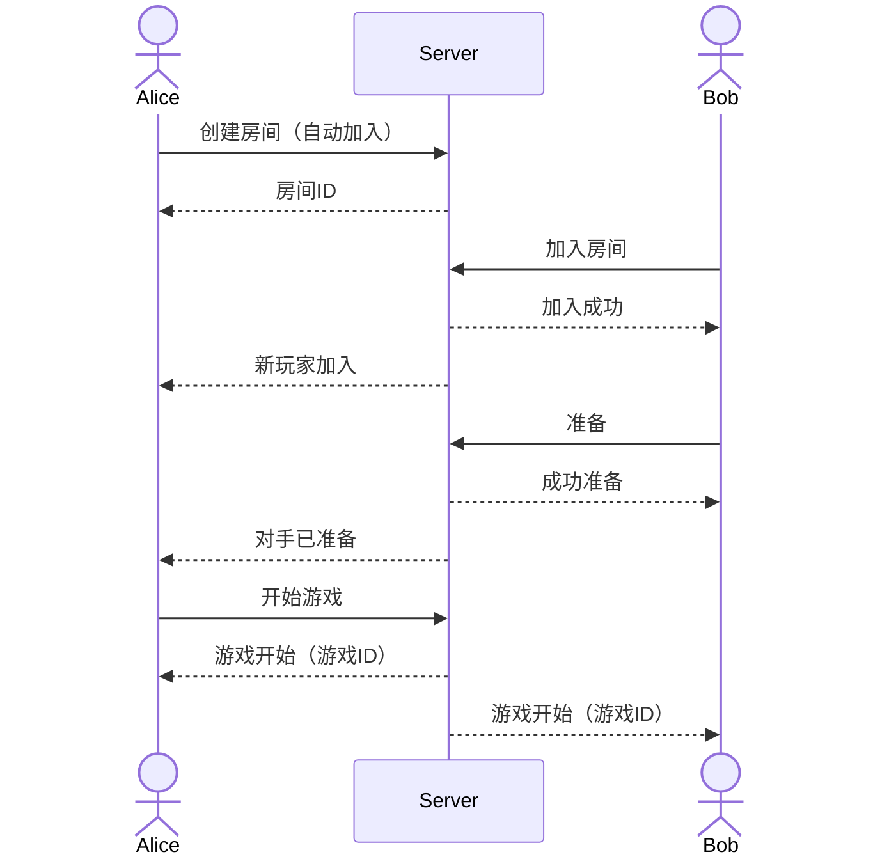

```mermaid
sequenceDiagram
    actor A as Alice
    participant S as Server
    actor B as Bob
    A->>S: 创建房间（自动加入）
    S-->>A: 房间ID
    B->>S: 加入房间
    S-->>B: 加入成功
    S-->>A: 新玩家加入
    B->>S: 准备
    S-->>B: 成功准备
    S-->>A: 对手已准备
    A->>S: 开始游戏
    S-->>A: 游戏开始（游戏ID）
    S-->>B: 游戏开始（游戏ID）
```
